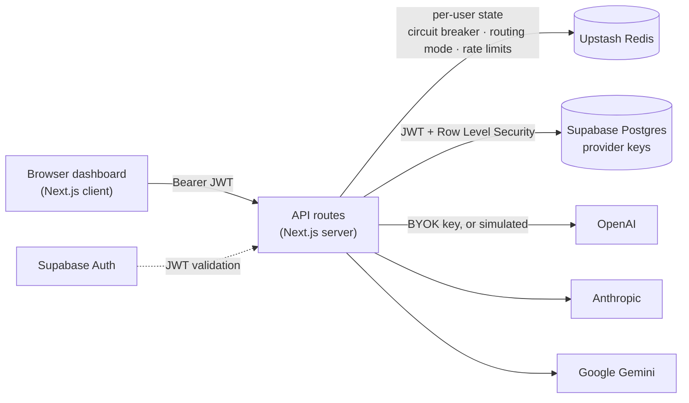
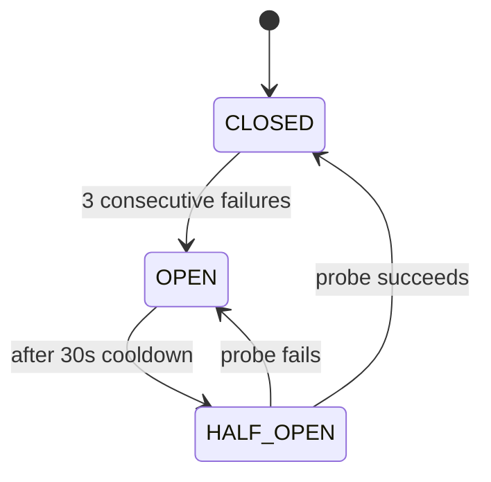

# NEXUS — AI Provider Resilience Gateway

**A gateway that keeps AI features alive when providers fail.**

NEXUS routes chat requests across **OpenAI, Anthropic, and Gemini**, automatically failing over
using a **circuit breaker**, **retries with exponential backoff**, and **cost/latency-aware
routing** — with per-user state isolation, per-user rate limits, and bring-your-own-key (BYOK)
real provider calls.

🔗 **Live demo:** https://nexus-api-resilience.vercel.app


> Sign up, optionally add your own provider key, and watch the failover engine work. With no keys
> configured, every provider runs in **simulation mode**, so the whole resilience demo is free.

---

## Why this exists

Any app that ships an AI feature inherits its provider's worst day: outages, rate limits, quota
exhaustion, slow responses. Retrying naively makes it worse — you hammer a struggling service.

NEXUS sits in front of multiple providers and absorbs those failures:

- A dead provider is detected and **skipped instantly** instead of costing every request a timeout.
- Failures are isolated with a **circuit breaker**, so a broken provider recovers on its own.
- Traffic is rerouted to the healthiest or cheapest provider according to the selected strategy.
- When *everything* is down, the client gets a clear, traceable error (with an incident ID) —
  never a hang and never a fake success.

---

## Features

| | |
|---|---|
| **Circuit breaker** | 3 consecutive failures → `OPEN`; 30s cooldown → `HALF_OPEN` probe → `CLOSED` or back to `OPEN` |
| **Retries** | 3 retries with exponential backoff (1s → 2s → 4s, capped at 10s) plus ±20% jitter |
| **Timeout guard** | 10s per attempt via `AbortController` — a hung provider can't hang the request |
| **Routing strategies** | `OFF` (fixed order), `COST` (cheapest first), `LATENCY` (fastest measured first) |
| **Health states** | `HEALTHY` / `DEGRADED` (>500ms or 5xx) / `DOWN`, refreshed every 10s |
| **Flapping detection** | A provider oscillating up/down gets its state locked for 2 minutes |
| **Per-user isolation** | Every piece of state is namespaced by user ID; proven with multiple accounts |
| **BYOK** | Users store their own provider keys — the platform never pays for usage |
| **Rate limiting** | Per user: 20 requests/min (sliding window) + 200/day, enforced in Redis |
| **Observability** | Incident IDs (`INC-2025-XXXX`) correlate the UI, the API response, and server logs |
| **Simulation fallback** | No key stored → that provider simulates, so demos need no credentials |

---

## Architecture



**Request flow for `POST /api/chat`:**

1. Validate the Supabase JWT (`auth.getUser(token)` — server-side revalidation).
2. Guard: per-user rate limit → debounce → input validation.
3. Load the caller's own provider keys from Postgres (RLS-scoped).
4. Order providers according to the caller's routing mode.
5. For each provider: check the circuit breaker, then attempt the call up to 4 times
   (1 + 3 retries) with backoff, jitter, and a 10s timeout per attempt.
6. Record every outcome — success resets the failure count, failures trip the breaker.
7. First success wins, and the response carries the full story (`routedTo`, `retryLog`,
   `circuitReason`).
8. All providers failed → `503` with an incident ID and every provider's real error logged.

### The circuit breaker



The point is *not* wasting time: without the breaker, a request to a dead provider pays the full
retry-and-backoff cost (in testing: ~25 seconds). With it, the dead provider is skipped instantly
and the request fails over.

---

## Bring your own key (BYOK)

Keys are stored in Postgres with **Row Level Security**: the policy
`auth.uid() = user_id` means the database itself rejects any row access that doesn't belong to the
authenticated user. The server builds a per-request Supabase client carrying the caller's own JWT —
**there is no service-role master key anywhere in the app**, and the UI only ever receives masked
tails (`••••abcd`).

Keys are also **encrypted at rest** with AES-256-GCM (`app/lib/crypto.js`) before they reach the
database, using a 32-byte `NEXUS_ENCRYPTION_KEY`. Each row gets a fresh random IV, and GCM's auth
tag means a modified ciphertext fails to decrypt instead of returning garbage. Stored values carry
an `enc:v1:` prefix, so rows written before encryption existed still read correctly and upgrade on
their next save.

> **Key-management tradeoff:** rotating or losing `NEXUS_ENCRYPTION_KEY` makes existing encrypted
> rows unreadable — affected users must re-enter their provider keys. That is the point of
> encryption, but it has to be said out loud. The variable is optional: without it, keys are stored
> unencrypted with a startup warning, so local setups still work.

> **The key design insight:** a real provider failure is just a failure. A `401` (bad key), `429`
> (quota/rate limit), or `5xx` throws like any simulated error and flows through the *same* retry →
> circuit-breaker → failover machinery. Adding real provider integrations required **zero changes**
> to the resilience engine.

---

## Tech stack

- **Next.js 16** (App Router, Turbopack) + **React 19**
- **Tailwind CSS 4** — dark dashboard UI
- **Recharts** — live latency chart
- **Upstash Redis** — circuit breaker state, routing mode, rate limits (shared across serverless
  instances and surviving restarts; the limiter enforces atomically via a Lua `EVAL`)
- **Supabase** — Auth (JWT) + Postgres with RLS (provider keys)
- **Vitest** — unit tests with a mocked Redis
- **Vercel** — deployment (auto-deploys from `main`)

---

## Getting started

```bash
git clone https://github.com/tanishsaini626-prog/nexus-api-resilience.git
cd nexus-api-resilience
npm install
cp .env.example .env.local   # then fill in the five values below
```

**Environment variables**

```bash
UPSTASH_REDIS_REST_URL=
UPSTASH_REDIS_REST_TOKEN=
NEXT_PUBLIC_SUPABASE_URL=
NEXT_PUBLIC_SUPABASE_ANON_KEY=
NEXUS_ENCRYPTION_KEY=        # 32-byte key, 64 hex chars — see command below
```

Generate the encryption key (it encrypts stored provider keys; if it's missing, keys are stored
unencrypted with a console warning, so local setups still run):

```bash
node -e "console.log(require('crypto').randomBytes(32).toString('hex'))"
```

**Database setup** — create the keys table + RLS policy by running
[`supabase/provider_keys.sql`](supabase/provider_keys.sql) in the Supabase SQL Editor.

**Run**

```bash
npm run dev      # http://localhost:3000
npm test         # Vitest (34 tests)
npm run lint
npm run build
```

Then sign up, and either add a provider key in the **API Keys** panel or leave it empty to stay in
simulation mode.

---

## API reference

All routes require `Authorization: Bearer <supabase access token>`.

| Route | Method | Purpose |
|---|---|---|
| `/api/chat` | `POST` | Routed chat with retries, circuit breaker, and failover |
| `/api/health` | `GET` | Parallel provider health checks, status counts, circuit summary |
| `/api/keys` | `GET` / `PUT` / `DELETE` | Manage the caller's own provider keys (masked tails only) |
| `/api/settings` | `POST` | Set routing mode (`OFF` / `COST` / `LATENCY`) |
| `/api/simulate` | `POST` | Force a provider `down` / `degraded` / `up` for demos |

---

## Engineering notes (bugs that taught the most)

- **Module state doesn't cross serverless routes.** The routing mode was a module variable, so
  `/api/settings` wrote it and `/api/chat` never saw it — invisible in dev, silently broken in
  production. Fix: any state two routes share lives in Redis, keyed per user.
- **`try` and `catch` are separate scopes.** `clearTimeout(timeoutId)` in a `catch` referencing a
  `const` from the `try` threw a masking `ReferenceError` on *every failed attempt*, replacing real
  provider errors with a generic 500. It survived 20+ commits because it only fires on failure
  paths.
- **"Pushed" ≠ "deployed" ≠ "live."** Every Vercel build had been failing (a Supabase URL read at
  build time was missing from the environment), leaving the live site frozen on an old version.
- **Real-world failures are the best tests.** A retired model name (`gemini-2.0-flash` → the API's
  own error named its replacement) and a free-tier quota `429` both exercised the retry, circuit
  breaker, and failover paths against real infrastructure.
- **Undiagnosable errors are a second bug.** The all-providers-failed path now logs every
  provider's exact error alongside the incident ID shown to the user.
- **A test can defeat the thing it tests.** The rate-limit script originally paced requests by
  *response* time — with a real provider taking ~9s per call, 25 requests spread across 4 minutes
  and never put 20 inside the 60-second window, so the limiter "passed" silently untested. Pacing
  by *send* time fixed the test, not the code.
- **Read-modify-write over REST isn't atomic.** The rate limiter's six-command flow admitted
  **25 of 25 concurrent requests** under a controlled race — the limit didn't exist for parallel
  traffic. It now runs as a single Lua `EVAL` (`NEXUS_RATE_LIMIT_V1`), which admits exactly 20 no
  matter how many arrive at once, and drops the request's Redis cost from 6 commands to 1.

See [`docs/study-guide.md`](docs/study-guide.md) for the full deep-dive.

---

## Limitations & next steps

- Health checks ping providers' public endpoints (latency + status); they are not authenticated
  model calls.
- Key management is deliberately minimal: one env var encrypts every stored provider key, with no
  rotation tooling. Rotating it orphans existing rows (the UI flags them `UNREADABLE`).
- The rate limiter is atomic (one Lua `EVAL`), but circuit-breaker state updates are still JS
  read-modify-write — a deliberate call, not an oversight: the state blob is written from several
  paths, so making only one path atomic doesn't compose, and the failure modes are self-healing (a
  duplicate probe or an extra counted failure changes nothing). Full atomicity means Lua for every
  writer, or RedisJSON + transactions.
- The crash-recovery cache (`lastKnownHealth`) is per-instance and best-effort **by design** — it
  exists for when Redis itself is unreachable, so persisting it in Redis would defeat its purpose.
- OpenAI and Anthropic success paths are wired and error-verified, but only exercised with real
  keys once a funded key is available.

---

## Roadmap

- [x] Circuit breaker, retries with backoff/jitter, health states, failover
- [x] Redis-backed shared state (survives restarts, works across serverless instances)
- [x] Supabase auth + per-user data isolation
- [x] BYOK real provider calls (OpenAI, Anthropic, Gemini) with simulation fallback
- [x] Per-user rate limiting (sliding window + daily cap)
- [x] Batch the health-check Redis reads (measured: 15 → 3 commands per poll, 80% fewer)
- [x] Encrypt provider keys at rest (AES-256-GCM, versioned format, legacy rows still readable)
- [x] Per-user guards — flapping, debounce, crash-recovery cache (no cross-user leakage)
- [x] Atomic rate limiting via Lua EVAL — 25 concurrent requests: old flow admitted 25, Lua admits
      exactly 20 (breaker left on documented read-modify-write; see Limitations)

---

## License

No license specified — all rights reserved by the author.
